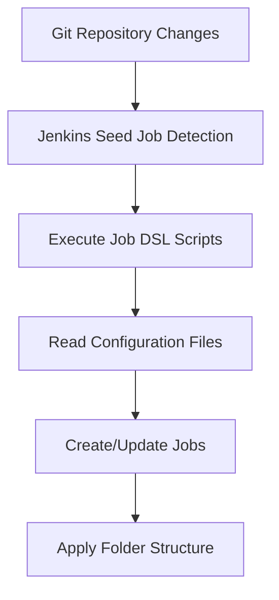

# Jenkins Job Infrastructure as Code (IaC) Guide

## 📋 Overview

This document provides a comprehensive guide on implementing **Job DSL** and **Jenkins Configuration as Code (CASC)** for Jenkins Job infrastructure management. Through this approach, all Job configurations are stored in Git repositories, enabling version control, automated synchronization, and team collaboration.

## 🏗️ Architecture Design

### Core Components

1. **Jenkins CASC**: Manages Jenkins system configuration and Seed Jobs
2. **Job DSL Seed Job**: Reads and executes Job DSL scripts from Git repository
3. **Git Repository**: Stores all Job configurations and DSL scripts
4. **Folder Plugin**: Provides Job organizational structure

### Workflow



## 🚀 Implementation Steps

### 1. Jenkins CASC Configuration

#### 1.1 Configure Seed Job

```yaml
# jenkins.yaml (CASC Configuration)
jobs:
  - script: |
      freeStyleJob('jenkins-jobs-seed') {
          displayName('Jenkins Jobs Seed')
          description('Creates and updates all Jenkins jobs from Git repository')
          
          scm {
              git {
                  remote {
                      url('https://github.com/your-org/jenkins-jobs.git')
                      credentials('git-credentials')
                  }
                  branch('*/main')
              }
          }
          
          triggers {
              scm('H/15 * * * *')  // Check Git changes every 15 minutes
          }
          
          steps {
              dsl {
                  external('jobs/**/*.groovy')
                  removeAction('DELETE')     // Delete non-existent jobs
                  removeViewAction('DELETE') // Delete non-existent views
                  ignoreExisting(false)      // Update existing jobs
              }
          }
      }
```

#### 1.2 Global Configuration

```yaml
# jenkins.yaml Global Configuration Section
jenkins:
  systemMessage: "Jenkins configured as code"
  numExecutors: 0
  mode: EXCLUSIVE
  
credentials:
  system:
    domainCredentials:
      - credentials:
          - usernamePassword:
              scope: GLOBAL
              id: "git-credentials"
              username: "${GIT_USERNAME}"
              password: "${GIT_TOKEN}"
              description: "Git repository credentials"

unclassified:
  globalLibraries:
    libraries:
      - name: "shared-lib"
        defaultVersion: "main"
        retriever:
          modernSCM:
            scm:
              git:
                remote: "https://github.com/your-org/shared-lib.git"
                credentialsId: "git-credentials"
```

### 2. Git Repository Structure

#### 2.1 Recommended Repository Structure
```sh
jenkins-jobs/
├── README.md
├── jobs/
│   ├── folders.groovy                 # Folder structure definition
│   ├── multibranch-pipelines.groovy   # Multibranch Pipeline definition
│   ├── freestyle-jobs.groovy          # Freestyle Job definition
│   └── views.groovy                   # View definition
├── config/
│   ├── apps-config.yaml              # Application configuration
│   ├── folders-config.yaml            # Folder configuration
│   └── global-settings.yaml           # Global settings
├── templates/
│   ├── multibranch-template.groovy    # Multibranch template
│   └── pipeline-template.groovy       # Pipeline template
└── scripts/
└── utilities.groovy               # Utility functions
```

#### 2.2 Folder Configuration

```yaml
# config/folders-config.yaml
folders:
  - path: "Applications"
    displayName: "Applications"
    description: "All application pipelines"
    
  - path: "Applications/Frontend"
    displayName: "Frontend Applications"
    description: "Frontend application pipelines"
    
  - path: "Applications/Backend"
    displayName: "Backend Services"
    description: "Backend service pipelines"
    
  - path: "Applications/Mobile"
    displayName: "Mobile Applications"
    description: "Mobile application pipelines"
    
  - path: "Infrastructure"
    displayName: "Infrastructure"
    description: "Infrastructure related jobs"
    
  - path: "Infrastructure/AWS"
    displayName: "AWS Infrastructure"
    description: "AWS infrastructure as code"
    
  - path: "Infrastructure/Kubernetes"
    displayName: "Kubernetes"
    description: "Kubernetes related jobs"
    
  - path: "Tools"
    displayName: "Tools & Utilities"
    description: "CI/CD tools and utilities"
```

#### 2.3 Application Configuration

```yaml
# config/apps-config.yaml
applications:
  # Frontend Applications
  - name: "react-app"
    folder: "Applications/Frontend"
    displayName: "React Application"
    description: "Frontend React application with TypeScript"
    repository:
      url: "https://github.com/your-org/react-app.git"
      credentials: "git-credentials"
    branches:
      include: "main develop feature/* release/*"
      exclude: "experimental/* temp/*"
    jenkinsfile: "Jenkinsfile"
    scanInterval: "4h"
    retention:
      days: 30
      builds: 50
    
  - name: "vue-app"
    folder: "Applications/Frontend"
    displayName: "Vue Application"
    description: "Frontend Vue application with Vuex"
    repository:
      url: "https://github.com/your-org/vue-app.git"
      credentials: "git-credentials"
    branches:
      include: "main develop feature/*"
    jenkinsfile: "Jenkinsfile"
    scanInterval: "6h"
    
  # Backend Services
  - name: "user-service"
    folder: "Applications/Backend"
    displayName: "User Service"
    description: "User management microservice with Spring Boot"
    repository:
      url: "https://github.com/your-org/user-service.git"
      credentials: "git-credentials"
    branches:
      include: "main develop feature/* release/* hotfix/*"
    jenkinsfile: "Jenkinsfile"
    scanInterval: "2h"
    retention:
      days: 60
      builds: 100
    
  - name: "order-service"
    folder: "Applications/Backend"
    displayName: "Order Service"
    description: "Order management microservice"
    repository:
      url: "https://github.com/your-org/order-service.git"
      credentials: "git-credentials"
    branches:
      include: "main develop feature/* release/*"
    jenkinsfile: "Jenkinsfile"
    scanInterval: "2h"
    
  # Infrastructure
  - name: "terraform-aws"
    folder: "Infrastructure/AWS"
    displayName: "AWS Infrastructure"
    description: "AWS infrastructure as code with Terraform"
    repository:
      url: "https://github.com/your-org/terraform-aws.git"
      credentials: "git-credentials"
    branches:
      include: "main develop"
    jenkinsfile: "infrastructure/Jenkinsfile"
    scanInterval: "1d"
    
  - name: "k8s-manifests"
    folder: "Infrastructure/Kubernetes"
    displayName: "Kubernetes Manifests"
    description: "Kubernetes deployment manifests"
    repository:
      url: "https://github.com/your-org/k8s-manifests.git"
      credentials: "git-credentials"
    branches:
      include: "main develop"
    jenkinsfile: "k8s/Jenkinsfile"
    scanInterval: "12h"
```

### 3. Job DSL Scripts

#### 3.1 Folder Creation Script

```groovy
// jobs/folders.groovy
@Library('yaml') _

// Read folder configuration
def configText = readFileFromWorkspace('config/folders-config.yaml')
def config = new YamlSlurper().parseText(configText)

// Create folders
config.folders.each { folderConfig ->
    folder(folderConfig.path) {
        displayName(folderConfig.displayName)
        description(folderConfig.description)
        
        // Add folder-level permissions (optional)
        if (folderConfig.permissions) {
            authorization {
                folderConfig.permissions.each { perm ->
                    permission(perm.permission, perm.user)
                }
            }
        }
    }
}
```

#### 3.2 Multibranch Pipeline Creation Script

```groovy
// jobs/multibranch-pipelines.groovy
@Library('yaml') _

// Read application configuration
def configText = readFileFromWorkspace('config/apps-config.yaml')
def config = new YamlSlurper().parseText(configText)

// Create Multibranch Pipeline Jobs
config.applications.each { app ->
    def jobName = "${app.folder}/${app.name}-multibranch"
    
    multibranchPipelineJob(jobName) {
        displayName(app.displayName)
        description(app.description)
        
        branchSources {
            git {
                id(app.name)
                remote(app.repository.url)
                credentialsId(app.repository.credentials)
                
                traits {
                    gitBranchDiscovery()
                    gitTagDiscovery()
                    
                    // Branch filtering
                    headWildcardFilter {
                        includes(app.branches.include)
                        if (app.branches.exclude) {
                            excludes(app.branches.exclude)
                        }
                    }
                    
                    // Cleanup and clone optimization
                    cleanBeforeCheckoutTrait()
                    cloneOptionTrait {
                        extension {
                            shallow(true)
                            depth(1)
                            noTags(false)
                        }
                    }
                    
                    // PR discovery (if GitHub)
                    if (app.repository.url.contains('github.com')) {
                        gitHubPullRequestDiscovery {
                            strategyId(1) // Merging the pull request with the current target branch revision
                        }
                    }
                }
            }
        }
        
        factory {
            workflowBranchProjectFactory {
                scriptPath(app.jenkinsfile ?: 'Jenkinsfile')
            }
        }
        
        // Trigger configuration
        triggers {
            periodicFolderTrigger {
                interval(app.scanInterval ?: '1d')
            }
        }
        
        // Retention strategy
        if (app.retention) {
            orphanedItemStrategy {
                discardOldItems {
                    if (app.retention.days) {
                        daysToKeep(app.retention.days)
                    }
                    if (app.retention.builds) {
                        numToKeep(app.retention.builds)
                    }
                }
            }
        }
        
        // Build retention strategy
        properties {
            buildDiscarder {
                strategy {
                    logRotator {
                        daysToKeepStr(app.retention?.days?.toString() ?: '30')
                        numToKeepStr(app.retention?.builds?.toString() ?: '50')
                        artifactDaysToKeepStr('7')
                        artifactNumToKeepStr('10')
                    }
                }
            }
        }
    }
}
```

#### 3.3 View Creation Script

```groovy
// jobs/views.groovy

// Create folder views
listView('All Applications') {
    description('All application pipelines')
    jobs {
        regex(/Applications\/.*\/.*-multibranch/)
    }
    columns {
        status()
        weather()
        name()
        lastSuccess()
        lastFailure()
        lastDuration()
        buildButton()
    }
}

listView('Frontend Apps') {
    description('Frontend application pipelines')
    jobs {
        regex(/Applications\/Frontend\/.*-multibranch/)
    }
    columns {
        status()
        weather()
        name()
        lastSuccess()
        lastFailure()
        lastDuration()
        buildButton()
    }
}

listView('Backend Services') {
    description('Backend service pipelines')
    jobs {
        regex(/Applications\/Backend\/.*-multibranch/)
    }
    columns {
        status()
        weather()
        name()
        lastSuccess()
        lastFailure()
        lastDuration()
        buildButton()
    }
}

listView('Infrastructure') {
    description('Infrastructure related jobs')
    jobs {
        regex(/Infrastructure\/.*\/.*-multibranch/)
    }
    columns {
        status()
        weather()
        name()
        lastSuccess()
        lastFailure()
        lastDuration()
        buildButton()
    }
}
```

### 4. Folder Plugin Best Practices

#### 4.1 Naming Conventions

- **Folder Naming**: Use PascalCase, e.g., `Applications`, `Infrastructure`
- **Job Naming**: Use kebab-case + type suffix, e.g., `user-service-multibranch`
- **Full Path**: `{Folder}/{SubFolder}/{JobName}`

#### 4.2 Permission Management

```groovy
// Set permissions at folder level
folder('Applications/Frontend') {
    displayName('Frontend Applications')
    description('Frontend application pipelines')
    
    authorization {
        permission('hudson.model.Item.Build', 'frontend-team')
        permission('hudson.model.Item.Read', 'frontend-team')
        permission('hudson.model.Item.Configure', 'frontend-leads')
    }
}
```

#### 4.3 Folder Properties

```groovy
folder('Applications') {
    displayName('Applications')
    description('All application pipelines')
    
    properties {
        // Folder-level build retention strategy
        buildDiscarder {
            strategy {
                logRotator {
                    daysToKeepStr('30')
                    numToKeepStr('50')
                }
            }
        }
    }
}
```

## 🔧 Advanced Configuration

### 1. Dynamic Configuration Generation

#### 1.1 Template-based Configuration

```groovy
// templates/multibranch-template.groovy
def createMultibranchPipeline(config) {
    return {
        multibranchPipelineJob("${config.folder}/${config.name}-multibranch") {
            displayName(config.displayName)
            description(config.description)
            
            branchSources {
                git {
                    id(config.name)
                    remote(config.repository.url)
                    credentialsId(config.repository.credentials)
                    
                    traits {
                        gitBranchDiscovery()
                        gitTagDiscovery()
                        headWildcardFilter {
                            includes(config.branches.include)
                            if (config.branches.exclude) {
                                excludes(config.branches.exclude)
                            }
                        }
                        cleanBeforeCheckoutTrait()
                        cloneOptionTrait {
                            extension {
                                shallow(true)
                                depth(1)
                            }
                        }
                    }
                }
            }
            
            factory {
                workflowBranchProjectFactory {
                    scriptPath(config.jenkinsfile ?: 'Jenkinsfile')
                }
            }
            
            triggers {
                periodicFolderTrigger {
                    interval(config.scanInterval ?: '1d')
                }
            }
        }
    }
}
```

#### 1.2 Environment-specific Configuration

```yaml
# config/environments/dev.yaml
environment: "development"
jenkins_url: "https://jenkins-dev.company.com"
default_scan_interval: "1h"
default_retention:
  days: 7
  builds: 20

# config/environments/prod.yaml
environment: "production"
jenkins_url: "https://jenkins.company.com"
default_scan_interval: "6h"
default_retention:
  days: 90
  builds: 200
```

### 2. Automation Scripts

#### 2.1 Configuration Validation Script

```bash
#!/bin/bash
# scripts/validate-config.sh

echo "Validating YAML configuration files..."

# Validate YAML syntax
for file in config/*.yaml; do
    echo "Validating $file"
    python -c "import yaml; yaml.safe_load(open('$file'))" || exit 1
done

# Validate required fields
python scripts/validate-schema.py config/apps-config.yaml

echo "Configuration validation completed successfully!"
```

#### 2.2 Bulk Operations Script

```bash
#!/bin/bash
# scripts/bulk-operations.sh

case $1 in
    "add-app")
        echo "Adding new application: $2"
        python scripts/add-application.py "$2" "$3" "$4"
        ;;
    "remove-app")
        echo "Removing application: $2"
        python scripts/remove-application.py "$2"
        ;;
    "update-branches")
        echo "Updating branch patterns for: $2"
        python scripts/update-branches.py "$2" "$3"
        ;;
    *)
        echo "Usage: $0 {add-app|remove-app|update-branches} [args]"
        exit 1
        ;;
esac
```

## 📊 Monitoring and Maintenance

### 1. Health Check

```groovy
// jobs/health-check.groovy
freeStyleJob('system/health-check') {
    displayName('Jenkins Health Check')
    description('Monitors Jenkins system health and job status')
    
    triggers {
        cron('H/30 * * * *') // Execute every 30 minutes
    }
    
    steps {
        shell('''
            #!/bin/bash
            # Check for failed jobs
            echo "Checking for failed jobs..."
            
            # Check disk space
            echo "Checking disk space..."
            df -h
            
            # Check Jenkins log errors
            echo "Checking Jenkins logs..."
            tail -n 100 $JENKINS_HOME/logs/jenkins.log | grep -i error || true
        ''')
    }
    
    publishers {
        emailExt {
            recipientList('devops-team@company.com')
            subject('Jenkins Health Check - ${BUILD_STATUS}')
            body('Health check results: ${BUILD_LOG}')
            trigger {
                failure {
                    sendTo {
                        recipientList()
                    }
                }
            }
        }
    }
}
```

### 2. Backup Strategy

```bash
#!/bin/bash
# scripts/backup-config.sh

BACKUP_DIR="/backup/jenkins-config"
DATE=$(date +%Y%m%d_%H%M%S)

# Create backup directory
mkdir -p "$BACKUP_DIR/$DATE"

# Backup configuration files
cp -r config/ "$BACKUP_DIR/$DATE/"
cp -r jobs/ "$BACKUP_DIR/$DATE/"
cp -r templates/ "$BACKUP_DIR/$DATE/"

# Compress backup
tar -czf "$BACKUP_DIR/jenkins-config-$DATE.tar.gz" -C "$BACKUP_DIR" "$DATE"

# Clean old backups (keep 30 days)
find "$BACKUP_DIR" -name "jenkins-config-*.tar.gz" -mtime +30 -delete

echo "Backup completed: jenkins-config-$DATE.tar.gz"
```

## 🚀 Deployment and Usage

### 1. Initial Deployment

```bash
# 1. Clone configuration repository
git clone https://github.com/your-org/jenkins-jobs.git
cd jenkins-jobs

# 2. Validate configuration
./scripts/validate-config.sh

# 3. Apply CASC configuration
# Place jenkins.yaml in Jenkins CASC configuration directory

# 4. Restart Jenkins or reload configuration
# Jenkins will automatically create Seed Job

# 5. Manually trigger Seed Job first execution
# Or wait for scheduled trigger
```

### 2. Daily Maintenance

```bash
# Add new application
./scripts/bulk-operations.sh add-app "new-service" "Applications/Backend" "https://github.com/org/new-service.git"

# Commit changes
git add .
git commit -m "Add new-service multibranch pipeline"
git push origin main

# Jenkins will automatically apply changes within 15 minutes
```

### 3. Troubleshooting

#### 3.1 Common Issues

1. **Seed Job Execution Failure**
   - Check Git repository access permissions
   - Validate YAML configuration syntax
   - Review Jenkins logs

2. **Job Creation Failure**
   - Check if folders exist
   - Validate Job name uniqueness
   - Check permission settings

3. **Configuration Not Applied**
   - Confirm Git changes are pushed
   - Check Seed Job trigger time
   - Manually trigger Seed Job

#### 3.2 Debugging Tips

```groovy
// Add debug information in Job DSL scripts
println "Processing application: ${app.name}"
println "Target folder: ${app.folder}"
println "Repository URL: ${app.repository.url}"
```

## 📈 Best Practices Summary

### ✅ Recommended Practices

1. **Configuration Separation**: Separate configuration data from DSL scripts
2. **Templating**: Use templates to reduce code duplication
3. **Version Control**: Include all configuration files in version control
4. **Automated Validation**: Validate configuration syntax before commits
5. **Progressive Deployment**: Validate in test environment before production
6. **Monitoring & Alerting**: Set up Seed Job execution status monitoring
7. **Regular Backups**: Regularly backup configuration files
8. **Documentation Maintenance**: Keep documentation in sync with actual configuration

### ❌ Practices to Avoid

1. **Manual Job Creation**: Avoid manually creating Jobs in Jenkins UI
2. **Hardcoded Configuration**: Avoid hardcoding configuration values in DSL scripts
3. **Ignoring Permissions**: Don't ignore folder and Job-level permission settings
4. **Lack of Testing**: Don't test configuration changes directly in production
5. **Configuration Redundancy**: Avoid duplicate configuration definitions

## 🔗 Related Resources

- [Jenkins Job DSL Official Documentation](https://jenkinsci.github.io/job-dsl-plugin/)
- [Jenkins Configuration as Code Documentation](https://github.com/jenkinsci/configuration-as-code-plugin)
- [Jenkins Folder Plugin Documentation](https://plugins.jenkins.io/cloudbees-folder/)
- [YAML Syntax Reference](https://yaml.org/spec/1.2/spec.html)

---

**Maintainer**: DevOps Team  
**Last Updated**: $(date +%Y-%m-%d)  
**Version**: 1.0